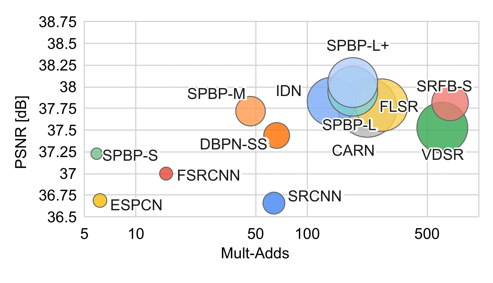
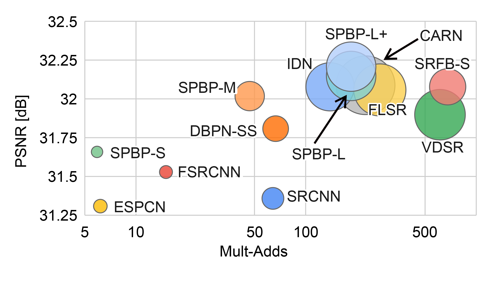
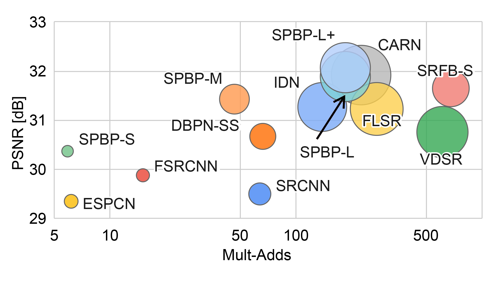

# SPBP (SubPixel-BackProjection) [[arXiv]](https://arxiv.org/abs/2008.01116)

This is the Pytorch code for our proposed SubPixel-BackProjection Network For Lightweight Single Image
Super-Resolution [Paper](https://www.researchgate.net/publication/342716640_Sub-Pixel_Back-Projection_Network_For_Lightweight_Single_Image_Super-Resolution).
Training code will be released soon.

### Dependencies
  * python 3.x
  * pytorch 1.1.0
  * cuda10
  * torch
  * torchvision
  * scikit-image
  * pillow
  * pyyaml
  * visdom
  * tqdm
  * opencv
  
#### Install Dependencies
```
# Create virtual environment
conda create -n sr_env

# Install torch
conda install pytorch torchvision cudatoolkit=10.0 -c pytorch

# Install skimage
conda install -c conda-forge scikit-image

# Install visdom
conda install -c conda-forge visdom

# Install pyyaml
conda install -c conda-forge pyyaml

# Install tqdm
conda install -c conda-forge tqdm

# Install OpenCV
onda install -c conda-forge opencv
```

## Datasets

This project contains 2/4 benchmark datasets Set5 and Set14 due to file size limitation.

All the benchmark datasets can be downloaded from: http://vllab.ucmerced.edu/wlai24/LapSRN/results/SR_testing_datasets.zip

To test BSDS100 and Urban100, check the directory options/test/ for SPBP_S.yaml, SPBP_M.yaml, SPBP_L.yaml and SPBP_L+.yaml 
and add the following snippet under the 'datasets:'
```
  test_3:  # the 2st test dataset
    name: BSDS100
    data_location: data/datasets/BSDS100/
    shuffle: false
    n_workers: 1  # per GPU
    batch_size: 1
    repeat: 1
  test_4:  # the 2st test dataset
    name: Urban100
    data_location: data/datasets/Urban100/
    shuffle: false
    n_workers: 1  # per GPU
    batch_size: 1
    repeat: 1
```

## Testing
```
To run the test, either python test.py -config options/test/CONFIG.yaml can be used or simply run the test_run.sh file.
```

## Results
Trade-off between reconstruction accuracy versus number of operations and parameters on three datasets. The xaxis and the y-axis denote the Multi-Adds and PSNR (evaluated on the Y channel), and the size of the circle represents the number of parameters. The Mult-Adds is computed for HR image of size 720p.

<p align="center">
 <figcaption>Set5</figcaption>
  
 
</p>
<p align="center">
 <figcaption>Set14</figcaption>
  
</p>
<p align="center">
 <figcaption>BSDS100</figcaption>
  
</p>
<p align="center">
 <figcaption>Urban100</figcaption>
  
</p>


## Citations
If you find this work useful, please consider citing it.
```
@article{banerjee2020subpixel,
    title={Sub-Pixel Back-Projection Network For Lightweight Single Image Super-Resolution},
    author={Banerjee, Supratik and Ozcinar, Cagri and Rana, Aakanksha and Smolic, Aljosa and Manzke, Michael},
    booktitle={arXiv preprint arXiv:2008.01116},
    year={2020}
}
```
